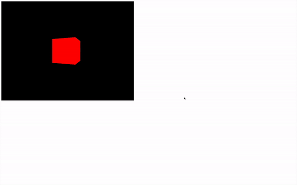
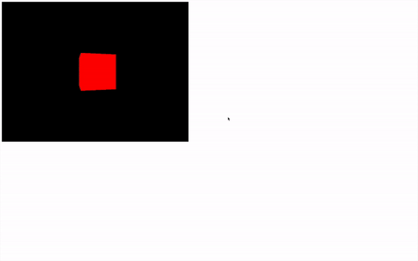
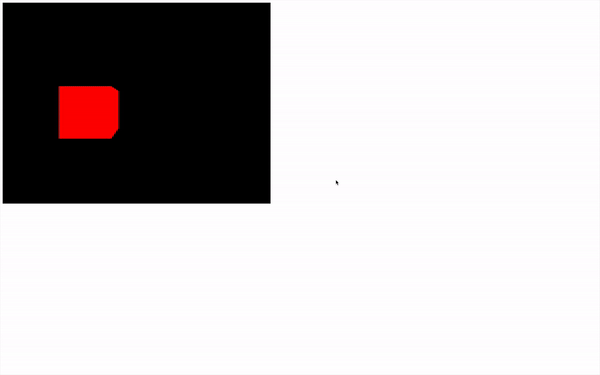

# Animations

## 시작에 앞서

Transform objects의 마지막 코드에서 한 번 렌더링된 장면을 만들었습니다. 이것만으로 이미 좋은 진전이지만, 대부분의 경우 창작물을 애니메이션화하고 싶어할 것입니다.

Three.js를 사용할 때 애니메이션은 정지 영상처럼 작동합니다. 객체를 움직이고 렌더링을 수행합니다. 그런 다음 객체를 조금 더 움직이고 다른 렌더링을 수행합니다. 렌더링 사이에 객체를 움직이는 정도가 많을수록, 그것들이 움직이는 것처럼 보일 것입니다.

여러분이 보고 있는 화면은 특정 주파수에서 동작합니다. 우리는 그것을 frame rate(프레임 레이트)라고 부릅니다. 프레임 레이트는 대부분 화면에 따라 다르지만, 컴퓨터 자체에도 한계가 있습니다. 대부분의 화면은 초당 60 프레임으로 실행됩니다. 계산을 하면, 이것은 대략 16ms마다 한 프레임을 의미합니다. 그러나 일부 화면은 훨씬 더 빠르게 동작할 수 있으며, 컴퓨터가 처리하는 데 어려움을 겪을 때는 더 느리게 실행될 것입니다.

프레임 레이트에 관계없이 각 프레임마다 객체를 움직이고 렌더링을 수행할 함수가 필요합니다.

네이티브 자바스크립트에서는 **`window.requestAnimationFrame(...)`** 메서드를 사용할 수 있습니다.

## requestAnimationFrame 사용하기

**`requestAnimationFrame`**의 주 목적은 각 프레임마다 코드를 실행하는 것이 아닙니다.

**`requestAnimationFrame`**은 다음 프레임에 제공된 함수를 실행할 것입니다. 그러나, 이 함수가 다음 프레임에서 동일한 함수를 실행하기 위해 **`requestAnimationFrame`**을 사용한다면, 여러분의 함수가 영원히 각 프레임마다 실행되는 결과를 얻게 될 것이며, 그것으로 원하는 결과를 얻을 수 있을 것입니다.

**`tick`** 이라는 이름의 함수를 생성하고 이 함수를 한 번 호출하세요. 이 함수 내에서 **`window.requestAnimationFrame(...)`**을 사용하여 다음 프레임에 이 같은 함수를 호출하세요:

```javascript
/**
 * 애니메이션
 */
const tick = () =>
{
    console.log('tick')

    window.requestAnimationFrame(tick)
}

tick()
```

이제 무한 루프가 생겼습니다.

콘솔에서 확인해보면, **`'tick'`**이 각 프레임마다 호출되고 있을 것입니다. 이 코드를 프레임 레이트가 높은 컴퓨터에서 테스트하면, **`'tick'`**이 더 높은 빈도로 나타날 것입니다.

이제 함수 안에 **`renderer.render(...)`** 호출을 옮기고 큐브의 회전을 증가시킬 수 있습니다:

```javascript
/**
 * 애니메이션
 */
const tick = () =>
{
    // 객체 업데이트
    mesh.rotation.y += 0.01

    // 렌더
    renderer.render(scene, camera)

    // 다음 프레임에 tick을 다시 호출
    window.requestAnimationFrame(tick)
}

tick()

```

<figure><figcaption></figcaption></figure>

애니메이션이 완성되었지만 문제가 있습니다. 만약 이 코드를 프레임 레이트가 높은 컴퓨터에서 테스트하면, 큐브가 더 빠르게 회전할 것이고, 프레임 레이트가 낮은 컴퓨터에서 테스트하면, 큐브가 더 느리게 회전할 것입니다.

### 프레임 레이트에 맞게 조정

애니메이션을 프레임 레이트에 맞추려면, 마지막 **`'tick'`** 이후 얼마나 많은 시간이 지났는지 알아야 합니다.

먼저, 시간을 측정하는 방법이 필요합니다. 네이티브 자바스크립트에서는 **`Date.now()`**를 사용해 현재 타임스탬프를 얻을 수 있습니다.

```javascript
const time = Data.now()
```

타임스탬프는 1970년 1월 1일 이후로 얼마나 많은 시간이 지났는지에 해당합니다. 자바스크립트에서는 밀리초 단위입니다.

이제 필요한 것은 현재 타임스탬프에서 이전 프레임의 타임스탬프를 빼서 우리가 **`'deltaTime`**' 이라고 부를 수 있는 값을 얻고, 이 값을 객체를 애니메이션하는 데 사용하는 것입니다:

```javascript
/**
 * 애니메이션
 */
let time = Date.now()

const tick = () =>
{
        // 시간
    const currentTime = Date.now()
    const deltaTime = currentTime - time
    time = currentTime

    // 객체 업데이트
    mesh.rotation.y += 0.01 * deltaTime

    // ...
}

tick()
```

<figure><figcaption></figcaption></figure>

이제 마지막 프레임 이후 경과한 시간에 기반하여 회전을 설정했기 때문에, 이 회전 속도는 프레임 레이트에 관계없이 모든 화면과 모든 컴퓨터에서 동일할 것입니다.

### Clock 사용

Three.js에 내장된 Clock을 사용하면 시간 계산을 보다 간단하게 처리할 수 있습니다. 이 코드는 그리 복잡하지 않지만, Clock이라는 내장 솔루션이 있어서 시간 계산을 쉽게 해결할 수 있습니다.

Clock 변수를 인스턴스화하고 내장 메서드인 **`getElapsedTime()`**을 사용하기만 하면 됩니다. 이 메서드는 Clock이 생성된 이후로 몇 초가 지났는지 반환합니다.

이 값을 사용하여 객체를 회전시킬 수 있습니다:

```javascript
/**
 * 애니메이션
 */
const clock = new THREE.Clock()

const tick = () =>
{
    const elapsedTime = clock.getElapsedTime()

    // 객체 업데이트
    mesh.rotation.y = elapsedTime

    // 렌더
    renderer.render(scene, camera)

    // 다음 프레임에 tick을 다시 호출
    window.requestAnimationFrame(tick)
}

tick()

```

이제 **`clock.getElapsedTime()`**을 사용하여 경과 시간에 따라 객체의 회전을 조절할 수 있습니다. 이 방법을 사용하면, 프레임 레이트에 관계없이 모든 화면과 모든 컴퓨터에서 회전 속도가 일정하게 유지됩니다.

<figure><figcaption></figcaption></figure>

\
**`position`** 속성을 사용하여 물체를 이동시키는 것도 가능합니다. **`Math.sin(...)`**과 결합하면 꽤 좋은 결과를 얻을 수 있습니다:

```javascript
/**
 * 애니메이션
 */
const clock = new THREE.Clock()

const tick = () =>
{
    const elapsedTime = clock.getElapsedTime()

    // 객체 업데이트
    mesh.position.x = Math.cos(elapsedTime)
    mesh.position.y = Math.sin(elapsedTime)

    // 렌더
    renderer.render(scene, camera)

    // 다음 프레임에 tick을 다시 호출
    window.requestAnimationFrame(tick)
}

tick()
```

이 방법을 사용하면, **`clock.getElapsedTime()`**으로 얻은 경과 시간을 기반으로 물체를 원형 경로로 이동시킬 수 있습니다. **`Math.cos(...)`**와 **`Math.sin(...)`**을 사용하여 x와 y 위치를 계산함으로써, 물체가 시간에 따라 원을 그리며 움직이게 됩니다.

<figure><figcaption></figcaption></figure>

이러한 기술을 사용하여 카메라와 같은 어떤 Object3D도 애니메이션할 수 있습니다:

<figure><figcaption></figcaption></figure>

또 다른 사용 가능한 메소드는 **`getDelta()`**입니다. 하지만 Clock 클래스 코드에서 정확히 무슨 일이 일어나고 있는지 모른다면 사용하지 않는 것이 좋습니다. 이를 사용하면 애니메이션에 문제가 생길 수 있고 원치 않는 결과를 얻을 수 있습니다.

### 라이브러리 사용

특정 방식으로 장면을 애니메이션하고 싶을 때 다른 라이브러리를 사용해야 할 수도 있습니다. 수많은 애니메이션 라이브러리가 있지만, 매우 유명한 하나는 GSAP입니다.

프로젝트에 GSAP을 추가하려면, Node.js가 제공하는 의존성 관리자인 npm을 사용할 수 있습니다.

서버가 실행되지 않는 상태에서 또는 같은 폴더에서 다른 터미널 창을 사용하여 터미널에서 **`npm install gsap@3.12`**를 실행합니다.

**`@3.12`**는 버전을 강제합니다. 이 버전을 사용하는 이유는 이 수업을 작성할 때 사용된 버전이기 때문입니다. 원한다면 **`@3.12`**를 제거하고 최신 버전을 시도해볼 수도 있습니다.

이제 GSAP은 **`node_modules/`** 폴더에 사용 가능하며, 우리는 이것을 **`script.js`**에서 가져올 수 있습니다:

```javascript
import './style.css'
import * as THREE from 'three'
import gsap from 'gsap'

// ...
```

GSAP을 사용하는 방법은 여러 가지가 있으며, 이것만으로도 전체 과정을 마칠 수 있지만, 이것이 이 과정의 목표는 아닙니다. 우리는 단순히 테스트를 위해 트윈(점 A에서 B로의 애니메이션)을 생성할 것입니다. 이미 GSAP 사용 방법을 알고 있다면, Three.js에서도 동일하게 작동합니다.

이전 애니메이션 관련 코드를 주석 처리하고 렌더링을 포함한 tick 함수를 유지하세요. 그런 다음 **`gsap.to(...)`**를 사용하여 트윈을 생성할 수 있습니다:

```javascript
/**
 * 애니메이션
 */
gsap.to(mesh.position, { duration: 1, delay: 1, x: 2 })

const tick = () =>
{
    // 렌더
    renderer.render(scene, camera)

    // 다음 프레임에 tick을 다시 호출
    window.requestAnimationFrame(tick)
}

tick()

```

<figure><figcaption></figcaption></figure>

GSAP은 내장된 **`requestAnimationFrame`**을 가지고 있으므로, 애니메이션을 직접 업데이트할 필요가 없지만, 큐브가 움직이는 것을 보고 싶다면, 각 프레임마다 장면을 계속 렌더링해야 합니다.\


### 올바른 해결책 선택하기

네이티브 자바스크립트와 애니메이션 라이브러리 사이에서 선택하는 것은 여러분이 달성하고자 하는 것에 달려 있습니다. 영원히 회전하는 캐러셀을 만들고 싶다면, 그것을 위한 어떤 라이브러리도 필요하지 않습니다. 하지만 예를 들어, 검의 휘두르기를 애니메이션하고 싶다면, 라이브러리를 사용하는 것을 선호할 수 있습니다.

간단한 애니메이션은 자바스크립트만으로 충분히 구현 가능하지만, 복잡한 타이밍, 다중 애니메이션의 조합, 사용자 상호작용에 따른 애니메이션 조정 같은 고급 기능이 필요한 경우 GSAP과 같은 애니메이션 라이브러리가 큰 도움이 될 수 있습니다. GSAP는 애니메이션을 매우 세밀하게 제어할 수 있게 해주며, 개발자가 보다 효율적으로 복잡한 애니메이션 시퀀스를 구현할 수 있게 도와줍니다.

