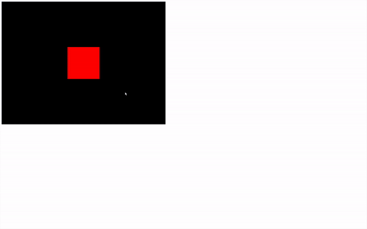

# Cameras

## 시작에 앞서

우리는 이미 PerspectiveCamera를 생성했지만, 문서에서 볼 수 있듯이 다른 유형의 카메라들도 있습니다.

* Camera

Camera 클래스는 우리가 추상 클래스라고 부르는 것입니다. 직접 사용할 의도는 아니지만, 공통 속성과 메서드에 접근하기 위해 이를 상속받을 수 있습니다. 다음 클래스 중 일부는 Camera 클래스로부터 상속받습니다.

* ArrayCamera

ArrayCamera는 여러 카메라를 사용하여 씬을 여러 번 렌더링하는 데 사용됩니다. 각 카메라는 캔버스의 특정 영역을 렌더링할 것입니다. 이것을 고전 콘솔 멀티플레이어 게임에서 우리가 분할 화면을 공유했던 것처럼 상상할 수 있습니다.

* StereoCamera

StereoCamera는 눈을 모방한 두 카메라를 통해 씬을 렌더링하여 우리가 패럴랙스 효과라고 부르는 것을 생성하는 데 사용됩니다. 이는 깊이가 있다고 뇌를 속이게 됩니다. VR 헤드셋이나 빨간색과 파란색 안경과 같은 적절한 장비가 있어야 결과를 볼 수 있습니다.

* CubeCamera

CubeCamera는 주변 환경의 렌더를 생성하기 위해 각 방향(앞, 뒤, 왼쪽, 오른쪽, 위, 아래)을 향한 렌더를 얻는 데 사용됩니다. 반사 또는 그림자 맵을 생성하는 데 사용할 수 있습니다. 이에 대해서는 나중에 더 자세히 이야기할 것입니다.

* OrthographicCamera

OrthographicCamera는 투시도 없이 씬의 직교 투영 렌더를 생성하는 데 사용됩니다. 이것은 Age of Empire와 같은 RTS 게임을 만들 때 유용합니다. 요소들은 카메라로부터의 거리에 관계없이 화면 상에서 동일한 크기를 가질 것입니다.

* PerspectiveCamera

PerspectiveCamera는 우리가 이미 사용한 것이며 투시도를 가진 실제 카메라를 시뮬레이션합니다.

**여기서는 OrthographicCamera와 PerspectiveCamera에 초점을 맞출 것입니다.**\


## PerspectiveCamera

앞서 보았듯이, PerspectiveCamera 클래스를 인스턴스화하기 위해서는 몇 가지 파라미터가 필요하지만, 가능한 모든 파라미터를 사용하지는 않았습니다. 세 번째와 네 번째 파라미터를 추가하세요:

```javascript
const camera = new THREE.PerspectiveCamera(75, sizes.width / sizes.height, 1, 100)
```

<figure><figcaption></figcaption></figure>

이제 파라미터에 대해 자세히 이야기해보겠습니다.

### Field of view (시야각)

### Aspect ratio (화면비율)

이전에 설명하였으므로 아래를 확인해주세요.

[#camera](first-three.js-project.md#camera "mention")


### Near and Far

세 번째와 네 번째 파라미터인 near와 far는 카메라가 얼마나 가까이와 얼마나 멀리 볼 수 있는지에 해당합니다. 근거리 값보다 카메라에 더 가깝거나 원거리 값보다 더 멀리 떨어져 있는 객체 또는 객체의 일부는 렌더에 나타나지 않습니다.

이것은 옛날 레이싱 게임에서 멀리서 나무가 나타나는 것을 볼 수 있었던 것과 비슷하게 생각할 수 있습니다.

매우 작은 값과 매우 큰 값을 사용하고 싶을 수도 있지만, 예를 들어 0.0001과 9999999 같은 값을 사용하면, z-fighting이라고 불리는 버그에 부딪힐 수 있습니다. 이는 두 면이 서로 어느 것이 더 위에 렌더링될지를 두고 "싸우는" 것처럼 보이게 합니다.

[https://twitter.com/FreyaHolmer/status/799602767081848832\
https://twitter.com/Snapman\_I\_Am/status/800567120765616128](https://twitter.com/FreyaHolmer/status/799602767081848832https:/twitter.com/Snapman\_I\_Am/status/800567120765616128)\


합리적인 값을 사용하려고 하고, 필요한 경우에만 이러한 값을 증가시키세요. 우리의 경우, 0.1과 100을 사용할 수 있습니다.

## OrthographicCamera

이 수업의 나머지 부분에서 이 유형의 카메라를 사용하지 않을 예정이지만, 특정 프로젝트에 유용할 수 있습니다.

OrthographicCamera는 PerspectiveCamera와 달리 투시도가 없다는 점이 다릅니다. 즉, 객체들이 카메라로부터의 거리에 관계없이 동일한 크기를 유지합니다.

제공해야 하는 파라미터는 PerspectiveCamera와 매우 다릅니다.

시야각 대신, 카메라가 각 방향(왼쪽, 오른쪽, 위, 아래)으로 볼 수 있는 거리를 제공해야 합니다. 그런 다음, PerspectiveCamera에 대해 했던 것처럼 near와 far 값을 제공할 수 있습니다.

PerspectiveCamera를 주석 처리하고 OrthographicCamera를 추가하세요. 위치 업데이트와 **`lookAt(...)`** 호출은 유지하세요:

```javascript
const camera = new THREE.OrthographicCamera(-1, 1, 1, -1, 0.1, 100)
```

<figure><figcaption></figcaption></figure>

투시도가 없기 때문에, 우리의 큐브의 변들이 평행해 보입니다. 문제는 우리의 큐브가 입방형처럼 보이지 않는다는 것입니다.

이는 제공한 왼쪽, 오른쪽, 위, 아래 값이 1 또는 -1이기 때문입니다. 즉, 정사각형 영역을 렌더링하지만, 그 정사각형 영역이 우리의 직사각형 캔버스에 맞게 늘어나고, 우리의 캔버스는 정사각형이 아닙니다.

캔버스의 비율(너비 대 높이)을 사용해야 합니다. **`aspectRatio`**라는 변수를 생성하고(마치 PerspectiveCamera에서처럼) 그 비율을 저장합시다:\


```javascript
const aspectRatio = sizes.width / sizes.height
const camera = new THREE.OrthographicCamera(-1 * aspectRatio, 1 * aspectRatio, 1, -1, 0.1, 100)
```

이렇게 하면, 캔버스의 종횡비에 맞춰 OrthographicCamera의 뷰포트를 조정하게 되어, 큐브가 실제와 같은 비율로 보이게 됩니다. 이 방식을 통해 OrthographicCamera를 사용하여 3D 장면을 직교 투영으로 보여줄 때, 객체의 비율이 왜곡되지 않고 정확하게 유지될 수 있습니다.

<figure><figcaption></figcaption></figure>

이제 우리는 입방체처럼 보이는 큐브를 가지게 되었습니다.

## Custom controls

이제 PerspectiveCamera로 돌아가 봅시다. OrthographicCamera를 주석 처리하고, PerspectiveCamera의 주석을 해제한 다음, 카메라를 이동하여 큐브를 향하게 하고, tick 함수에서 메시 회전을 제거하세요:

```javascript
// Camera
const camera = new THREE.PerspectiveCamera(75, sizes.width / sizes.height, 1, 1000)

// const aspectRatio = sizes.width / sizes.height
// const camera = new THREE.OrthographicCamera(- 1 * aspectRatio, 1 * aspectRatio, 1, - 1, 0.1, 100)

// camera.position.x = 2
// camera.position.y = 2
camera.position.z = 3
camera.lookAt(mesh.position)
scene.add(camera)
```

이제 우리가 하고 싶은 것은 마우스로 카메라를 제어하는 것입니다. 우선, 마우스 좌표를 알아야합니다. 이는 네이티브 자바스크립트를 사용하여 **`mousemove`** 와 **`addEventListener`**로 할 수 있습니다.

좌표는 콜백 함수의 인자로 **`event.clientX`**와 **`event.clientY`**에서 위치할 것입니다:

```javascript
// Cursor
window.addEventListener('mousemove', (event) =>
{
    console.log(event.clientX, event.clientY)
})
```

이러한 값을 직접 사용할 수도 있지만, 조정하는 것이 좋습니다. 조정한다는 것은, 값을 양수와 음수 모두 가능하게 하고, 1의 진폭을 가지도록 하는 것을 의미합니다.

x 값에만 집중한다면, 이것은 다음과 같을 것입니다:

* 커서가 캔버스의 가장 왼쪽에 있을 경우, -0.5를 얻어야 합니다.
* 커서가 캔버스의 중앙에 있을 경우, 0을 얻어야 합니다.
* 커서가 캔버스의 가장 오른쪽에 있을 경우, 0.5를 얻어야 합니다.

이것이 필수적인 것은 아니지만, 이렇게 깔끔한 값들을 가지는 것이 도움이 됩니다.

**`size`** 변수와 마찬가지로, 기본 x와 y 속성을 가진 **`cursor`** 변수를 생성하고, 그 속성들을 **`mousemove`** 콜백에서 업데이트할 것입니다:

```javascript
// Cursor
const cursor = {
    x: 0,
    y: 0
}

window.addEventListener('mousemove', (event) =>
{
    cursor.x = event.clientX / sizes.width - 0.5
    cursor.y = event.clientY / sizes.height - 0.5

    console.log(cursor.x, cursor.y)
})
```

**`event.clientX`**를 **`sizes.width`**로 나누면 0과 1 사이의 값이 나옵니다(커서를 캔버스 위에 두는 경우), 0.5를 빼면 -0.5와 0.5 사이의 값이 나옵니다.

이제 **`cursor`** 객체 변수에 마우스 위치가 저장되어 있으며, **`tick`** 함수에서 카메라의 위치를 업데이트할 수 있습니다:

```javascript
const tick = () =>
{
    // ...

    // Update camera
    camera.position.x = cursor.x
    camera.position.y = cursor.y

    // ...
}
```

<figure><figcaption></figcaption></figure>

보시다시피 작동은 하지만, 축의 움직임이 어딘가 잘못된 것처럼 보입니다. 이는 Three.js에서 **`position.y`** 축이 위로 갈 때 양수가 되지만, 웹페이지에서 **`clientY`** 축이 아래로 갈 때 양수가 되기 때문입니다.

**`cursor.y`**를 업데이트할 때 전체 수식 앞에 **`-`**를 추가하여 간단히 반전시킬 수 있습니다(괄호를 잊지 마세요):

```javascript
window.addEventListener('mousemove', (event) =>
{
    cursor.x = event.clientX / sizes.width - 0.5
    cursor.y = - (event.clientY / sizes.height - 0.5)
})

```

<figure><figcaption></figcaption></figure>

최종적으로, **`cursor.x`**와 **`cursor.y`**에 값을 곱하여 진폭을 증가시키고 **`lookAt(...)`** 메소드를 사용하여 카메라가 메시를 바라보게 할 수 있습니다:

```javascript
const tick = () =>
{
    // ...

    // 카메라 업데이트
    camera.position.x = cursor.x * 5
    camera.position.y = cursor.y * 5
    camera.lookAt(mesh.position)

    // ...
}

```

<figure><figcaption></figcaption></figure>

메시 주변을 완전히 회전하는 카메라를 만들기 위해 **`Math.sin(...)`**과 **`Math.cos(...)`**을 사용하여 한 단계 더 나아갈 수 있습니다.

**`sin`**과 **`cos`**을 결합하고 동일한 각도로 사용하면, 물체를 원 위에 배치할 수 있습니다. 전체 회전을 하려면, 그 각도는 2π(파이라고 함)의 진폭을 가져야 합니다. 참고로, 전체 회전은 "타우"라고 불리지만, 자바스크립트에서는 이 값을 직접 사용할 수 없고 대신 π를 사용해야 합니다.

자바스크립트에서 π의 근사치에 접근할 수 있는 방법은 **`Math.PI`**를 사용하는 것입니다.

그 원의 반지름을 증가시키려면, **`Math.sin(...)`**과 **`Math.cos(...)`**의 결과에 곱하기만 하면 됩니다:

```javascript
const tick = () =>
{
    // ...

    // 카메라 업데이트
    camera.position.x = Math.sin(cursor.x * Math.PI * 2) * 2
    camera.position.z = Math.cos(cursor.x * Math.PI * 2) * 2
    camera.position.y = cursor.y * 3
    camera.lookAt(mesh.position)

    // ...
}

tick()

```

<figure><figcaption></figcaption></figure>

카메라를 제어하기 위한 좋은 시작점이긴 하지만, Three.js에는 이와 동일하게, 그리고 더 많은 것을 할 수 있도록 도와주는 '컨트롤'이라고 불리는 여러 클래스가 통합되어 있습니다.

## Built-in controls (내장 컨트롤)

* DeviceOrientationControls

DeviceOrientationControls는 장치, 운영 체제, 브라우저가 허용하는 경우 자동으로 장치의 방향을 검색하고 그에 따라 카메라를 회전시킵니다. 적절한 장비가 있다면 몰입감 있는 우주나 VR 경험을 만들기 위해 사용할 수 있습니다.

* FlyControls

FlyControls는 우주선에 탑승한 것처럼 카메라를 이동할 수 있게 해줍니다. 모든 3축에서 회전하고, 전진하고 후진할 수 있습니다.

* FirstPersonControls

FirstPersonControls는 FlyControls와 비슷하지만, 위쪽 축이 고정되어 있습니다. 이것은 새가 날아다니는 뷰처럼 보이지만, 새가 배럴 롤을 할 수 없는 것과 같습니다. FirstPersonControls에 "FirstPerson"이 들어가긴 하지만, FPS 게임처럼 작동하지는 않습니다.

* PointerLockControls

PointerLockControls는 포인터 잠금 자바스크립트 API를 사용합니다. 이 API는 커서를 숨기고, 중앙에 고정시키며, mousemove 이벤트 콜백에서 움직임을 계속 전송합니다. 이 API를 사용하면 브라우저 내에서 FPS 게임을 만들 수 있습니다. 이 클래스는 그러한 상호 작용을 만들고 싶을 때 매우 유망해 보일 수 있지만, 포인터가 잠긴 경우에만 카메라 회전을 처리합니다. 카메라 위치와 게임 물리는 직접 처리해야 합니다.

* ObritControls

OrbitControls는 이전 수업에서 만든 컨트롤과 매우 유사합니다. 마우스 왼쪽 버튼으로 포인트 주변을 회전하고, 마우스 오른쪽 버튼을 사용하여 측면으로 이동하고, 휠을 사용하여 확대 또는 축소할 수 있습니다.

* TrackballControls

TrackballControls는 OrbitControls와 같지만, 수직 각도에 대한 제한이 없습니다. 장면이 뒤집혀도 계속 회전하고 카메라로 스핀을 할 수 있습니다.

* TransformControls

TransformControls는 카메라와 관련이 없습니다. 객체를 이동하기 위해 객체에 기즈모를 추가하는 데 사용할 수 있습니다.

* DragControls

TransformControls와 마찬가지로, DragControls는 카메라와 관련이 없습니다. 카메라를 향하는 평면에서 객체를 드래그 앤 드롭하여 이동할 수 있습니다.

**우리는 OrbitControls만 사용할 것이지만, 다른 클래스들을 테스트해 보는 것도 좋습니다.**

## OrbitControls

**`tick`** 함수에서 카메라를 업데이트하는 부분을 주석 처리합시다.

### Instantiating (인스터스화)

먼저, **`OrbitControls`** 클래스를 사용하여 변수를 인스턴스화해야 합니다. 여기서 **`THREE.OrbitControls`**를 사용할 수 있다고 생각할 수도 있지만, 안타깝게도 그렇지 않습니다.

**`OrbitControls`** 클래스는 **`THREE`** 변수에서 기본적으로 사용할 수 없는 클래스들 중 하나입니다. 이 결정은 라이브러리의 크기를 줄이기 위한 것입니다.&#x20;

**`OrbitControls`** 클래스가 **`THREE`** 변수에서 사용할 수 없을 수도 있지만, 여전히 의존성 폴더 안에 위치하고 있습니다. 이를 가져오려면, **`/node_modules/`** 폴더 내부에서의 경로를 제공해야 합니다. 즉, **`/three/examples/jsm/controls/OrbitControls.js`**입니다:

```javascript
import { OrbitControls } from 'three/examples/jsm/controls/OrbitControls.js'
```

이제 **`OrbitControls`** 클래스를 사용하여 변수를 인스턴스화할 수 있습니다(**`THREE.`** 없이). 그리고 이 작업은 카메라를 생성한 후에 해야 합니다.

이것이 작동하려면, 파라미터로 카메라와 마우스 이벤트를 처리할 페이지 내의 요소를 제공해야 합니다:

```javascript
// 컨트롤
const controls = new OrbitControls(camera, canvas)
```

<figure><figcaption></figcaption></figure>

이제 마우스 왼쪽 버튼이나 오른쪽 버튼을 사용하여 드래그 앤 드롭을 하거나, 스크롤을 올리거나 내려서 확대하거나 축소할 수 있습니다.

우리가 만든 사용자 지정 코드보다 훨씬 쉽고, 더 많은 컨트롤을 제공합니다. 하지만 조금 더 나아가 봅시다.

### Target (목표)

기본적으로 카메라는 장면의 중심을 바라보고 있습니다. 이를 **`target`** 속성으로 변경할 수 있습니다.

이 속성은 **`Vector3`**이므로, 그 x, y, z 속성을 변경할 수 있습니다.

기본적으로 **`OrbitControls`**가 큐브 위를 바라보게 하려면, y 속성을 증가시키기만 하면 됩니다:

```javascript
controls.target.y = 2
```

하지만 이것만으로는 작동하지 않습니다. 왜냐하면 **`OrbitControl`**에 자신을 업데이트하라고 알려줘야 하기 때문입니다. 그리고 이는 바로 다음에 **`update`** 메소드를 호출함으로써 할 수 있습니다:

```javascript
controls.target.y = 2
controls.update()
```

하지만 이는 우리의 경우에 그다지 유용하지 않으므로, 이 부분은 주석 처리합시다.

### Damping (댐핑)

OrbitControls의 문서를 읽어보면, damping에 대한 언급이 있습니다. 댐핑은 일종의 가속도와 마찰 공식을 추가하여 애니메이션을 부드럽게 만듭니다.

댐핑을 활성화하려면, **`controls`**의 **`enableDamping`** 속성을 **`true`**로 설정합니다.

제대로 작동하려면, **`controls.update()`**를 호출하여 매 프레임마다 컨트롤을 업데이트해야 합니다. 이는 **`tick`** 함수에서 할 수 있습니다:

```javascript
// 컨트롤
const controls = new OrbitControls(camera, canvas)
controls.enableDamping = true

// ...

const tick = () =>
{
    // ...

    // 컨트롤 업데이트
    controls.update()

    // ...
}

```

<figure><figcaption></figcaption></figure>

이제 컨트롤이 훨씬 부드러워진 것을 볼 수 있습니다.

회전 속도, 줌 속도, 줌 제한, 각도 제한, 댐핑 강도, 키 바인딩(키보드도 사용할 수 있습니다)과 같이 컨트롤을 사용자 정의할 수 있는 많은 다른 메소드와 속성을 사용할 수 있습니다.
