# Debug UI

## 시작에 앞서

모든 창의적 프로젝트에서 필수적인 측면은 그것을 쉽게 조정할 수 있는 능력입니다. 개발자(당신)와 프로젝트 작업에 참여하는 다른 이해 관계자들(디자이너나 심지어 클라이언트 같은)은 가능한 많은 파라미터를 변경할 수 있어야 합니다.

완벽한 색상, 속도, 수량 등을 찾을 수 있도록 이를 고려해야 합니다. 심지어 예상치 못한 결과가 멋지게 보일 수도 있습니다.

먼저, 디버그 UI가 필요합니다.

HTML / CSS / JS를 사용하여 자체 디버그 UI를 만들 수 있지만, 이미 여러 라이브러리가 있습니다:

* [dat.GUI](https://github.com/dataarts/dat.gui)
* [lil-gui](https://lil-gui.georgealways.com/)
* [control-panel](https://github.com/freeman-lab/control-panel)
* [ControlKit](https://github.com/automat/controlkit.js)
* [Uil](https://github.com/lo-th/uil)
* [Tweakpane](https://tweakpane.github.io/docs/)
* [Guify](https://github.com/colejd/guify)
* [Oui](https://github.com/wearekuva/oui)

이 모든 것들이 우리가 원하는 것을 할 수 있지만, lil-gui를 사용할 것입니다. 이것은 인기가 있고, 유지 관리가 되며, 사용하기 쉬우므로 선택합니다.

## dat.GUI에서 lil-gui로

초기에, Three.js Journey 연습 문제들은 모두 dat.GUI를 사용했습니다.

얼마 동안 이 라이브러리는 업데이트되지 않았고, NPM에서는 설치 시 취약점 경고를 트리거하기 시작했습니다. 그 취약점들은 그 이후에 해결되었지만, 대안들이 나타나기 시작했고, 그 결과 lil-gui가 dat.GUI의 대체재로 점점 인기를 얻게 되었습니다. 추가적인 보너스로, 더 나은 기능들을 제공한다는 점입니다.

모든 Three.js Journey 연습 문제들은 이제 lil-gui를 사용하고 있지만, 비디오에서 dat.GUI에 대한 참조를 발견할 수도 있습니다. 그것들을 무시하고 lil-gui를 같은 방식으로 사용하세요.

참고로, GUI는 Graphical User Interface의 약자입니다.

### 예제

저의 포트폴리오에서 디버그 UI의 꽤 좋은 예제를 찾을 수 있습니다. 이 UI는 URL에 **`#debug`**를 추가할 때만 나타납니다.

[https://bruno-simon.com/#debug](https://bruno-simon.com/#debug)\


<figure><figcaption></figcaption></figure>

중력, 색상, 속도, 요소의 위치 등을 조정할 수 있습니다.

이 모든 조정 기능을 만드는 데 많은 시간이 걸렸지만, 이것 없이는 게임이 덜 균형 잡혀 보일 것입니다.

## lil-gui 인스터스화

프로젝트에 lil-gui를 추가하기 위해서, 우리는 Node.js에 포함된 의존성 관리 도구인 NPM을 사용할 수 있습니다(이전 수업에서 GSAP을 위해 했던 것처럼).

서버가 실행 중이지 않거나 같은 폴더에서 다른 터미널 창을 사용하여 터미널에서 **`npm install lil-gui`**를 실행하세요.

lil-gui는 이제 **`node_modules/`** 폴더에 사용 가능하며, 우리는 이것을 **`script.js`**로 가져올 수 있습니다. 서버를 다시 시작하는 것을 잊지 마세요:

```javascript
import './style.css'
import * as THREE from 'three'
import { OrbitControls } from 'three/examples/jsm/controls/OrbitControls.js'
import gsap from 'gsap'
import GUI from 'lil-gui'

// ...
```

이제 우리는 **`gui`** 변수에서 lil-gui를 인스턴스화할 수 있고, 이 작업은 바로 가져오기 이후, 맨 처음에 할 수 있습니다:

```javascript
/**
 * Debug
 */
const gui = new GUI()
```

<figure><figcaption></figcaption></figure>

나머지 수업에서는 다음과 같은 코드를 볼 수도 있습니다:

```javascript
import * as dat from 'lil-gui'

// ...

const gui = new dat.GUI()
```

기본적으로 같은 것을 의미합니다. 선호하는 솔루션을 자유롭게 사용하세요.

## 다양한 종류의 조정

오른쪽 상단 구석에는 빈 패널이 보입니다. 그 패널에 추가할 수 있는 다양한 유형의 조정 사항들이 있습니다:

* **Range**: 최소값과 최대값이 있는 숫자용
* **Color**: 다양한 형식의 색상용
* **Text**: 간단한 텍스트용
* **Checkbox**: 불리언(참 또는 거짓)용
* **Select**: 값 목록에서 선택하는 용도
* **Button**: 함수를 트리거하는 용도

이러한 조정 사항들 중 일부를 살펴보겠습니다.

### Range

첫 번째로 추가할 조정은 범위(range)입니다.

대부분의 조정은 **`gui.add(...)`**를 사용하여 추가할 수 있습니다. 첫 번째 매개변수는 객체이고, 두 번째 매개변수는 조정하고자 하는 그 객체의 속성입니다.

객체와 그 속성을 생성한 후에 **`gui.add(...)`**를 추가해야 합니다. 그렇지 않으면, 아직 존재하지 않는 무언가를 조정하도록 lil-gui에 요청하게 됩니다.

**`mesh.position.y`**를 사용해 보겠습니다:

```javascript
const mesh = new THREE.Mesh(geometry, material)
scene.add(mesh)

gui.add(mesh.position, 'y')
```

<figure><figcaption></figcaption></figure>

패널에 입력 창이 나타나야 합니다. 이를 변경해 보고 큐브가 그에 따라 움직이는 것을 관찰하세요.

최소값, 최대값, 정밀도를 지정하려면 파라미터에서 이를 설정할 수 있습니다:

```javascript
gui.add(mesh.position, 'y', -3, 3, 0.01)
```

<figure>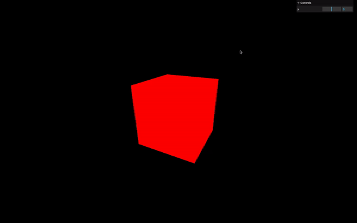<figcaption></figcaption></figure>

이렇게 하면 드래그 앤 드롭할 수 있는 편리한 범위 입력이 생깁니다.

많은 파라미터를 선호하지 않는다면, `add(...)` 메소드 바로 후에 `min(...)`, `max(...)`, `step(...)` 메소드를 체이닝하여 사용할 수 있습니다:

```javascript
gui.add(mesh.position, 'y').min(- 3).max(3).step(0.01)
```

\
이렇게 하면 드래그 앤 드롭할 수 있는 편리한 범위 입력이 생깁니다.

많은 파라미터를 선호하지 않는다면, `add(...)` 메소드 바로 후에 `min(...)`, `max(...)`, `step(...)` 메소드를 체이닝하여 사용할 수 있습니다:

```javascript
javascriptCopy codegui.add(mesh.position, 'y').min(- 3).max(3).step(0.01)
```

그리고 한 줄에 너무 많은 메소드 체이닝을 선호하지 않는다면, 단순히 줄바꿈을 추가할 수 있습니다:

레이블을 변경하려면 `name(...)` 메소드를 사용하세요:

```javascript
gui
    .add(mesh.position, 'y')
    .min(- 3)
    .max(3)
    .step(0.01)
    .name('elevation')
```

<figure><figcaption></figcaption></figure>

### 비속성에 대한 조정

여기서 주목해야 할 중요한 점은 lil-gui가 오직 속성만 수정할 수 있다는 것입니다. 변수를 업데이트하고 싶다면, 직접적으로 할 수 없습니다:

```javascript
let myVariable = 1337
gui.add(myVariable, '???')
```

하지만, lil-gui에서 사용할 목적으로 속성을 보유하는 객체를 생성하는 등의 방법으로 이를 수행할 수 있는 몇 가지 트릭이 있습니다:

```javascript
const myObject = {
    myVariable: 1337
}
gui.add(myObject, 'myVariable')
```

<figure><figcaption></figcaption></figure>

### Checkbox

lil-gui는 조정하고자 하는 속성의 유형을 자동으로 감지하고 해당하는 인터페이스를 사용합니다. `Object3D`의 `visible` 속성이 좋은 예입니다. 이는 불리언 값으로, `false`이면 객체를 숨깁니다:

```javascript
gui.add(mesh, 'visible')
```

<figure><figcaption></figcaption></figure>

보시다시피, `visible` 속성이 불리언이기 때문에 lil-gui는 체크박스를 선택했습니다.

재질의 `wireframe` 속성에 대해서도 동일하게 할 수 있습니다:

```javascript
gui.add(material, 'wireframe')
```

<figure>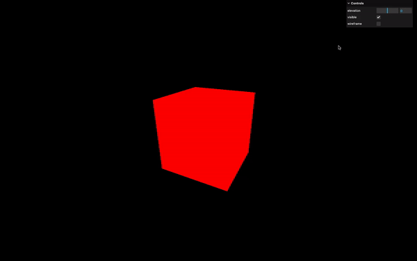<figcaption></figcaption></figure>

### Colors

먼저, `color` 속성이 문자열, 불리언, 또는 숫자가 아니기 때문에 `add(...)` 대신 `addColor(...)`를 사용해야 합니다. `color`는 Three.js의 `Color` 클래스의 인스턴스이므로 다양한 속성을 가진 객체입니다. 이러한 속성 중에는 `r`, `g`, `b`가 있으며, lil-gui는 이를 사용하여 멋진 조정 UI를 표시할 수 있습니다:

```javascript
gui.addColor(material, 'color')
```

<figure>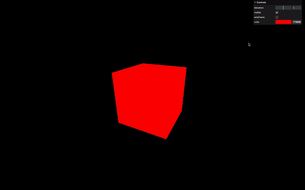<figcaption></figcaption></figure>

패널에 색상 선택기가 보일 것입니다.

이제 조정한 색상 값을 가져와서 `color` 속성에 적용해 보세요:

<figure>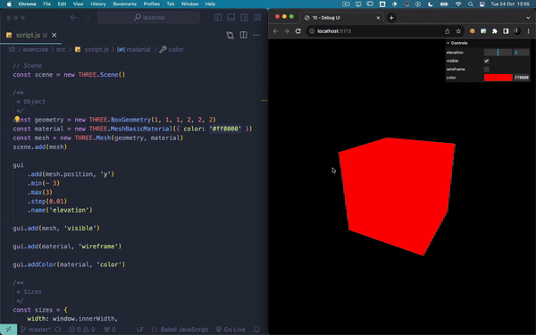<figcaption></figcaption></figure>

잘못된 색상이 나타날 수 있습니다:

이는 Three.js가 렌더링을 최적화하기 위해 일부 색상 관리를 적용하기 때문입니다. 결과적으로, 조정 UI에 표시되는 색상 값이 내부적으로 사용되는 값과 동일하지 않습니다.

우리는 지금 색상 관리에 대해 이야기하지 않고, 이 주제는 미래의 수업에서 다룰 것입니다. 하지만, 우리는 올바른 색상 값을 원합니다.

이 문제를 다루는 두 가지 방법이 있습니다.

#### 수정된 색상 검색

첫 번째 해결책은 조정 값이 변경될 때 Three.js에 의해 내부적으로 사용되는 색상을 `Color` 인스턴스의 `getHexString()` 메소드를 통해 검색하는 것입니다.

먼저, 조정 변경 사항을 인식해야 합니다. 이를 위해 `onChange()` 메소드를 사용할 수 있습니다:

```javascript
gui
    .addColor(material, 'color')
    .onChange(() =>
    {
        console.log('값이 변경되었습니다')
    })
```

<figure>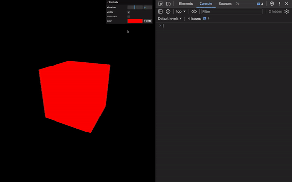<figcaption></figcaption></figure>

다음으로, `Color` 인스턴스에 접근해야 하며, 이를 위해 전통적인 `material.color`를 사용하거나 함수의 매개변수로 직접 값을 검색할 수 있습니다:

```javascript
gui
    .addColor(material, 'color')
    .onChange((value) =>
    {
        console.log(material.color)
        console.log(value)
    })
```

<figure><figcaption></figcaption></figure>

두 출력 모두 재질의 `color` 속성에서 나온 같은 `Color` 인스턴스입니다.

`value`를 사용하고 `getHexString()`의 결과를 로그에 출력해 보겠습니다:

```javascript
gui
    .addColor(material, 'color')
    .onChange((value) =>
    {
        console.log(value.getHexString())
    })
```

그래서, 이것이 코드에서 안전하게 사용할 수 있는 색상 값입니다.

<figure>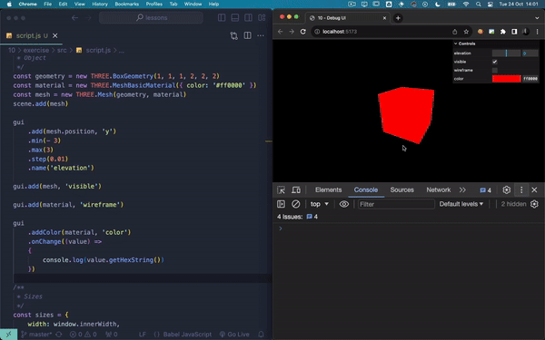<figcaption></figcaption></figure>

이 기술의 문제점은 콘솔을 열어두어야 하며, 특히 디자이너나 클라이언트에게는 편리하지 않다는 것입니다.

#### 수정되지 않은 색상만 다루기

두 번째 해결책은 Three.js에 의해 색상이 수정되기 전에 색상을 다루는 것입니다.

먼저, Three.js 밖의 어딘가에 색상을 저장해야 합니다. 속성을 보유할 목적으로 객체를 생성할 것입니다.

개인적으로 이를 `global`, `parameters`, 또는 `debugObject`라고 부르고 lil-gui 인스턴스를 생성한 직후에 위치시키는 것을 선호합니다:

```javascript
const gui = new GUI()
const debugObject = {}
```

그런 다음, `debugObject`에 색상 속성을 추가하고 큐브를 생성하기 전에 이를 수행하여 즉시 `MeshBasicMaterial`의 색상 속성에 전달할 것입니다:

```javascript
debugObject.color = '#3a6ea6'

const geometry = new THREE.BoxGeometry(1, 1, 1, 2, 2, 2)
const material = new THREE.MeshBasicMaterial({ color: debugObject.color, wireframe: false })
```

이렇게 하면 초기 색상을 단 한 곳에만 가지게 됩니다.

그런 다음, 이전에 `material.color`에 적용했던 조정 대신에 `debugObject.color`로 변경할 것입니다:

```javascript
gui
    .addColor(debugObject, 'color')
    .onChange((value) =>
    {
        console.log(value) // `value.getHexString()`에서 수정됨
    })
```

마지막으로, `console.log()` 대신에 `set()` 메소드를 사용하여 `material.color`를 업데이트할 것입니다:

```javascript
gui
    .addColor(debugObject, 'color')
    .onChange(() =>
    {
        material.color.set(debugObject.color)
    })
```

<figure>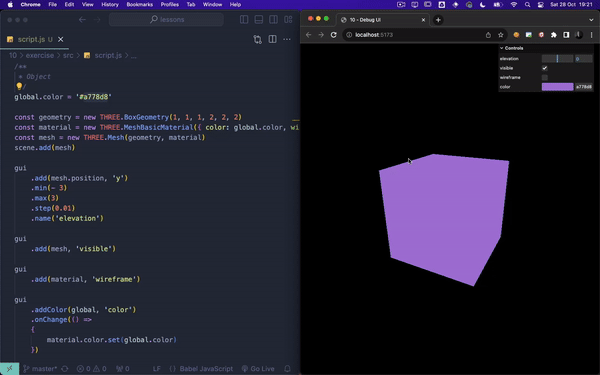<figcaption></figcaption></figure>

이 솔루션을 사용하면 콘솔을 열 필요 없이 누구나 사용할 수 있지만, 선택은 여러분에게 달렸습니다.

`debugObject.color`를 `#a778d8`로 다시 설정합시다.


### Function / Button

가끔은 요청 시에 명령을 실행하고 싶을 때가 있습니다. 지금 우리는 디버그 UI의 어딘가를 클릭할 때 큐브가 작은 회전 애니메이션을 수행하게 만들고 싶습니다.

함수를 포함하는 속성을 조정에 전달함으로써 이를 수행할 수 있습니다. 불행히도, 이는 우리가 자체적으로 함수를 이렇게 보유한 다음 lil-gui에 전달할 수 없음을 의미합니다:

```javascript
const myFunction = () => {
    console.log('do something')
}
gui.add(myFunction, '???')
```

하지만, 앞서 생성한 `debugObject` 객체에 `spin` 속성을 추가하고 그 안에 GSAP 애니메이션을 통합할 수 있습니다:

```javascript
debugObject.spin = () =>
{
    gsap.to(mesh.rotation, { duration: 1, y: mesh.rotation.y + Math.PI * 2 })
}
```

마지막으로, `debugObject.spin`에 조정을 추가할 수 있습니다:

```javascript
debugObject.spin = () =>
{
    // ...
}
gui.add(debugObject, 'spin')
```

<figure>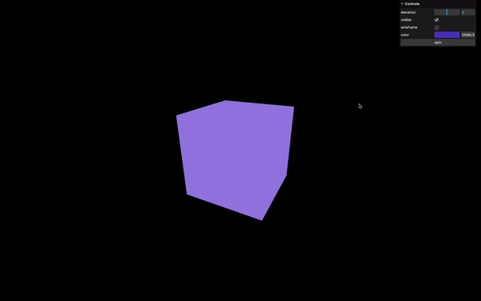<figcaption></figcaption></figure>

"spin" 버튼을 보게 될 것이며, 이 버튼을 클릭하면 큐브가 360도 회전하는 결과를 볼 수 있습니다.

#### 기하학 조정

기하학 세분화(subdivision)를 조정해 보는 건 어떨까요?

먼저, 삼각형을 시각화하기 위해 와이어프레임을 `true`로 설정하겠습니다:

```javascript
const material = new THREE.MeshBasicMaterial({ color: '#9c7fe3', wireframe: true })
```

<figure><figcaption></figcaption></figure>

`BoxGeometry` 문서를 확인하면, 세분화를 제어하는 파라미터가 `widthSegments`, `heightSegments`, `depthSegments`로 명명되어 있는 것을 볼 수 있습니다.

`geometry.widthSegments`에 대한 조정을 추가해 보겠습니다:

```javascript
gui
    .add(geometry.parameters, 'widthSegments', 1, 20, 1)
    .name('Width Segments')
    .onChange(() => {
        updateGeometry();
    });
```

<figure><figcaption></figcaption></figure>

`widthSegments`는 기하학 객체의 속성이 아니기 때문에 에러가 발생합니다.

`widthSegments`는 `BoxGeometry`를 인스턴스화할 때 전달하는 파라미터일 뿐입니다. 이 파라미터는 기하학 전체를 단 한 번만 생성하는 데 사용됩니다.

먼저, 실제 속성이 아니기 때문에, `debugObject` 객체에 `subdivision` 속성을 추가하고 이에 대한 조정을 적용해야 합니다:

```
debugObject.subdivision = 2
gui
    .add(debugObject, 'subdivision', 1, 20, 1)
    .onChange(() => {
        updateGeometry();
    });

```

`subdivision`이라고 이름 지은 이유는 `widthSegments`, `heightSegments`, `depthSegments` 모두에 사용할 수 있도록 하기 위해서입니다.

다음으로, 조정 값이 변경될 때, 우리는 이전 기하학을 파괴하고 새로운 것을 구축할 것입니다.

이를 위해, 우리는 먼저 조정의 `onChange` 이벤트를 듣기 시작할 것입니다:

```javascript
gui
    .add(debugObject, 'subdivision', 1, 20, 1)
    .onChange(() =>
    {
        console.log('세분화가 변경되었습니다')
    })
```

<figure><figcaption></figcaption></figure>

기하학을 구축하는 것은 CPU에 대해 상당히 긴 과정일 수 있습니다. 현재 우리는 사용자가 범위 조정을 많이 드래그 앤 드롭하면 자주 트리거될 수 있는 변경 이벤트를 감지하고 있습니다.

`onChange`를 사용하는 대신, 값을 조정하는 것을 멈췄을 때만 트리거되는 `onFinishChange`를 사용할 것입니다:

```javascript
gui
    .add(debugObject, 'subdivision', 1, 20, 1)
    .onFinishChange(() =>
    {
        console.log('세분화 조정이 완료되었습니다')
    })
```

<figure>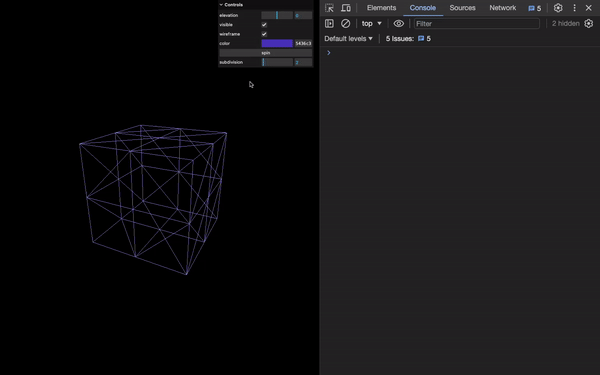<figcaption></figcaption></figure>

`console.log()` 대신에, `debugObject.subdivision`을 사용하여 새로운 기하학을 구축하고, 이를 메시의 `geometry` 속성에 할당하여 메시와 연결할 수 있습니다:

```javascript
gui
    .add(debugObject, 'subdivision', 1, 20, 1)
    .onFinishChange(() =>
    {
        const newGeometry = new THREE.BoxGeometry(
            1, 1, 1,
            debugObject.subdivision, debugObject.subdivision, debugObject.subdivision
        );
        mesh.geometry.dispose(); // 이전 기하학 리소스 해제
        mesh.geometry = newGeometry; // 새 기하학 할당
    })
```

<figure><figcaption></figcaption></figure>

하지만 우리는 작은 실수를 했습니다. 오래된 기하학들이 여전히 GPU 메모리 어딘가에 남아 있어 메모리 누수를 일으킬 수 있습니다.

이를 해결하기 위해, 새로운 기하학을 생성하기 전에 이전 기하학에 대해 `dispose()` 메소드를 호출할 수 있습니다:

```javascript
gui
    .add(debugObject, 'subdivision', 1, 20, 1)
    .onFinishChange(() =>
    {
        mesh.geometry.dispose(); // 이전 기하학의 리소스 해제
        mesh.geometry = new THREE.BoxGeometry(
            1, 1, 1,
            debugObject.subdivision, debugObject.subdivision, debugObject.subdivision
        );
    })
```

### Folders

많은 조정 사항들이 있고 디버그 UI가 복잡해지기 시작한다고 상상해 봅시다. `addFolder()` 메소드를 사용하여 폴더로 구분할 수 있습니다.

폴더를 생성하려면, `addFolder()`를 호출하고 원하는 이름을 매개변수로 전달하세요. 조정 사항들을 추가하기 전에 이 작업을 수행하고, 그것을 `cubeTweaks`로 저장하세요:

```javascript
const cubeTweaks = gui.addFolder('Awesome cube')
```

<figure>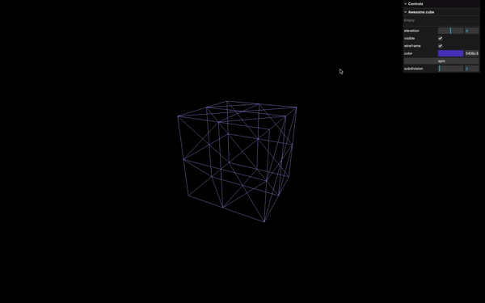<figcaption></figcaption></figure>

그런 다음, 조정 사항을 생성하기 위해 `gui` 대신 `cubeTweaks` 변수를 사용하세요:

```javascript
const cubeTweaks = gui.addFolder('Awesome cube')

cubeTweaks
    .add(mesh.position, 'y')
    // ...

cubeTweaks
    .add(mesh, 'visible')

cubeTweaks
    .add(material, 'wireframe')

cubeTweaks
    .addColor(material, 'color')
    // ...

// ...
cubeTweaks
    .add(debugObject, 'spin')

// ...
cubeTweaks
    .add(debugObject, 'subdivision')
    // ...
```

<figure>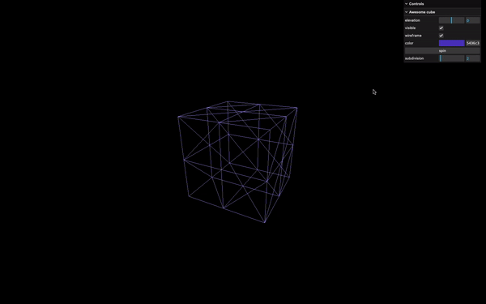<figcaption></figcaption></figure>

기본적으로 폴더를 닫으려면 `close()` 메소드를 사용할 수 있습니다:

```javascript
const cubeTweaks = gui.addFolder('Awesome cube')
cubeTweaks.close()
```

<figure><figcaption></figcaption></figure>

비록 우리가 실제로 실행하지는 않겠지만, 폴더 안에 폴더를 중첩시킬 수도 있습니다. 디버그 UI가 지저분해질 변명은 없습니다!

`close()` 호출을 주석 처리합시다:

```javascript
// cubeTweaks.close()
```

<figure><figcaption></figcaption></figure>

## GUI setup

### Width

GUI 생성자에 `width` 속성을 가진 객체를 전달하여 너비를 제어할 수 있습니다:

```javascript
const gui = new GUI({
    width: 300
});
```

<figure><figcaption></figcaption></figure>

### Title

패널 상단의 제목을 `title` 속성으로 변경할 수 있습니다:

```javascript
const gui = new GUI({
    width: 300,
    title: 'Nice debug UI'
});
```

<figure><figcaption></figcaption></figure>

### Close folders

`closeFolders`를 사용하여 기본적으로 모든 폴더를 닫을 수 있습니다:

```javascript
const gui = new GUI({
    width: 300,
    title: 'Nice debug UI',
    closeFolders: true
})
```

<figure><figcaption></figcaption></figure>

### Close

`close()` 메소드를 호출함으로써 GUI를 닫을 수 있습니다:

```javascript
const gui = new GUI({
    width: 300,
    title: 'Nice debug UI',
    closeFolders: false,
});
gui.close();
```

<figure><figcaption></figcaption></figure>

### Hide

GUI를 완전히 숨기려면 `hide()` 메소드를 호출할 수 있습니다:

```javascript
const gui = new GUI({
    width: 300,
    title: 'Nice debug UI',
    closeFolders: false,
});
// gui.close()
gui.hide();
```

<figure><figcaption></figcaption></figure>

### Toggling

다시 표시하려면 어떻게 해야 할까요? 방법은 여러분에게 달렸지만, 빠른 해결책 중 하나는 `keydown` 이벤트를 듣고, 그것이 'h' 키인 경우, 현재 숨겨져 있는지를 나타내는 불리언 값인 `_hidden` 속성을 기준으로 토글하는 것입니다:

```javascript
window.addEventListener('keydown', (event) =>
{
    if(event.key == 'h')
        gui.show(gui._hidden)
})
```

<figure><figcaption></figcaption></figure>

## 더 많은 정보

여기까지 입니다. 그러나 궁금하다면, 스타일링, 위치 지정, 속성이 변경될 때 트윅을 업데이트하는 기능과 같은 더 많은 설정 및 기능을 위해 lil-gui 문서를 살펴보세요:

* 스타일링
* 위치 지정
* 속성이 변경될 때 트윅 업데이트
* Select와 같은 다른 유형의 트윅
* 등등.

## 결론&#x20;

다음 연습 중에는 특정 순간에만 디버그 UI를 사용할 것입니다. 그러나 원하는 만큼 많은 트윅을 추가하십시오. 이것은 연습하고 창의적인 작품을 만들기 시작하는 훌륭한 방법입니다.

진행하면서 트윅을 추가하는 것을 권장합니다. 프로젝트의 끝에 모든 트윅을 추가하기로 생각한다면, 아마도 전혀 트윅이 없거나 놓친 기회가 많아질 것입니다.

다음 레슨 중 일부는 lil-gui 대신 dat.GUI를 사용하여 녹화되었습니다. 이것은 큰 차이를 만들지 않으며 문제없이 따라갈 수 있어야 합니다.\
