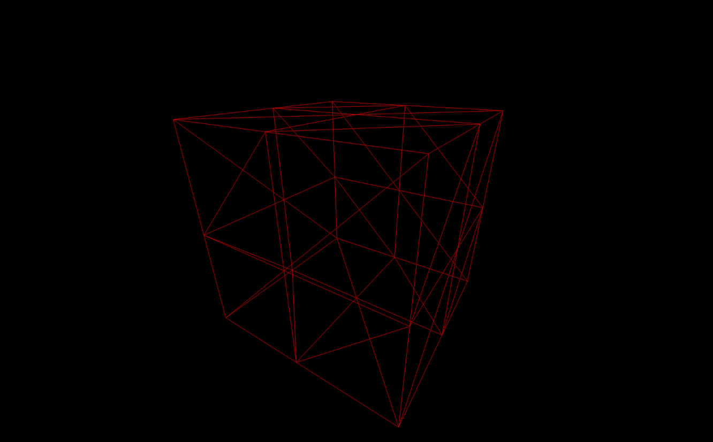

# First Three.js Project

## Three.js 시작하기

## Three.js 설치하기

```bash
npm install three
```

## Three.js 가져오기

```javascript
import * as THREE from 'three'
```

이것으로 Three.js의 모든 핵심 클래스들을 THREE 변수 안으로 가져옵니다.

## 첫 번째 Scene

이제 장면을 만들고 화면에 무언가를 표현할 시간입니다.

시작하기 위해서는 4가지의 요소가 필요합니다:

1. 객체를 포함할 Scene
2. 몇몇 객체들
3. 카메라
4. 렌더러

### Scene

Scene은 컨테이너와 같습니다. 객체, 모델, 파티클, 빛 등을 그 안에 배치하고, 어느 시점에 Three.js에게 그 장면을 렌더링하도록 요청합니다.

장면을 생성하기 위해서는 Scene 클래스를 사용합니다.

```javascript
const scene = new THREE.Scene();
```

### Object (객체)

객체는 여러가지가 될 수 있습니다. 기본 지오메트리, 가져온 모델, 파티클, 빛 등이 있을 수 있습니다.

여기서는 간단한 빨간색 큐브로 시작할 것입니다.

빨간색 큐브를 만들기 위해서, **`mesh(메시)`**라고 불리는 객체 유형을 생성해야 합니다. 메시는 geometry(지오메트리)와 material(재질)의 결합입니다.

많은 geometry와 material이 있지만, 여기서는 단순하게 유지하고 **`BoxGeometry`**와 **`MeshBasicMaterial`**을 생성할 것입니다.

geometry를 생성하기 위해, **`BoxGeometry`** 클래스를 사용하며 첫 3개의 파라미터는 상자의 크기에 해당합니다.

```javascript
const geometry = new THREE.BoxGeometry(1, 1, 1);
```

material을 생성하기 위해서, **`MeshBasicMaterial`** 클래스를 사용하여 하나의 파라미터: 모든 옵션이 담긴 객체 **`{}`**를 사용합니다. 이제 해야 할것은 색상 속성을 지정하는 것뿐입니다.

Three.js에서 색상을 지정하는 방법은 여러 가지가 있습니다. JS의 16진수 **`'0xff0000'`**로 보낼 수도 있고, 문자열 16진수 **`'#ff0000'`**로 보낼 수도 있으며**`'red'`**같은 색상 이름을 사용하거나 Color 클래스의 인스턴스를 보낼 수도 있습니다.

```javascript
const geometry = new THREE.BoxGeometry(1, 1, 1);
const material = new THREE.MeshBasicMaterial({color: 0xff0000});
```

최종 mesh를 생성하기 위해서 Mesh 클래스를 사용하고 파라미터로 geometry와 material을 보냅니다.

```javascript
const geometry = new THREE.BoxGeometry(1, 1, 1);
const material = new THREE.MeshBasicMaterial({color: 0xff0000});
const mesh = new THREE.Mesh(geometry, material);
```

이제 **`add(...)`**메서드를 통해 장면에 mesh를 추가할 수 있습니다.

scene에 객체를 추가하지 않으면, 화면에서 볼 수 없습니다.

```javascript
scene.add(mesh);
```

### Camera (카메라)

카메라는 보이지 않습니다. 이 부분은 더 이론적인 시점입니다. scene을 렌더링할 때, 카메라의 시점에서 렌더링될 것입니다.

영화 세트처럼 여러 카메라를 가질 수 있고, 원하는대로 카메라들 사이를 전환할 수 있습니다. 보통은 하나의 카메라만 사용합니다.

카메라에는 여러 종류가 있습니다. 지금 당장은, 가까운 객체를 먼 객체보다 더 크게 보이게 하는 **`PerspectiveCamera`** 클래스를 사용합니다.

두 가지의 필수 파라미터가 필요합니다.

1. 시야각 (Field Of View)

시야각은 시야의 각도가 얼마나 큰지를 나타냅니다. 매우 큰 각도를 사용하면, 한 번에 모든 방향을 볼 수 있지만, 결과가 작은 사각형에 그려지기 때문에 많은 왜곡이 발생합니다. 작은 각도를 사용하면, 물체들이 확대된 것처럼 보일 것입니다. 시야각(fov)는 도로 포현되며, 수직 시야각에 해당합니다. 여기서는 75도 각을 사용할 것입니다.

<figure><figcaption><p>시야각이 큰 경우</p></figcaption></figure>

<figure><figcaption><p>시야각이 작은 경우</p></figcaption></figure>

2. 화면 비율 (aspect ratio)

대부분의 경우, 화면 비율은 캔버스의 넓이를 그 높이로 나눈 값입니다. 재사용 가능한 값이 있는 sizes 객체를 생성할 것입니다.

```javascript
// 크기
const sizes = {
    width: 800,
    height: 600
};

// 카메라
const camera = new THREE.PerspectiveCamera(75, sizes.width / sizes.height);
scene.add(camera);

```

### Renderer (렌더러)

단순히 렌더러에게 카메라의 시점에서 우리의 scene을 렌더링하도록 요청할 것이고, 결과는 캔버스에 그려질 것입니다. 캔버스는 직접 생성하거나 렌더러가 생성하게 한 후 페이지에 추가할 수 있습니다. 여기서는 HTML에 캔버스를 추가하고 렌더러에게 전달 할 것입니다.

**`'index.html'`**에서 **`<canvas>`** 요소를 생성하고 클래스를 부여하세요:

```javascript
<canvas class="webgl"></canvas>
```

렌더러를 생성하기 위해, **`WebGLRenderer`** 클래스를 사용합니다. 이 클래스에는 모든 옵션이 담긴 객체 **`{}`**를 파라미터로 하나 넣어야 합니다. 페이지에 추가한 **`<canvas>`**에 해당하는 canvas 속성을 지정해야 합니다.

코드 시작 부분에서 canvas 변수를 생성하고, **`document.querySelector(...)`**를 사용하여 HTML에서 생성한 요소를 찾아 저장합니다.

canvas를 변수에 할당하는 것이 좋습니다. 이후에 계속 사용이 되기 때문입니다.

또한, 앞서 생성한 sizes 객체를 사용하여 **`setSize(...)`** 메서드로 렌더러의 크기를 업데이트해야 합니다.

**`setSize(...)`** 메서드는 자동으로 우리의 **`<canvas>`** 크기를 조절할 것입니다.

```javascript
// 캔버스
const canvas = document.querySelector('canvas.webgl')

// 위에서 작성한 코드

// 렌더러
const renderer = new THREE.WebGLRenderer({
    canvas: canvas
})
renderer.setSize(sizes.width, sizes.height)

```

## 첫 번째 렌더링

이제 첫 번째 렌더링을 할 시간입니다. 렌더러에서 **`render(...)`** 메서드를 호출하고 scene과 카메라를 파타미터로 넣어 줍니다.

```javascript
renderer.render(scene, camera);
```

<figure><figcaption></figcaption></figure>

하지만 검은 화면만 보이고 빨간색 큐브는 보이지 않습니다.

문제는 객체의 위치나 카메라의 위치를 지정하지 않았다는 것입니다. 둘 다 기본 위치, 즉 scene의 중심에 있으며, 기본적으로 객체의 내부에서는 객체를 볼 수 없습니다.

이 부분을 해결하기 위해, 각 객체에는 **`position, rotation, scale`**과 같은 여러 속성에 접근할 수 있습니다. 여기서는 **`position`** 속성을 사용하여 카메라를 뒤로 이동시킵니다.

**`position`** 속성은 x, y, z 세 가지 관련 속성을 가진 객체입니다. 기본적으로, Three.js는 전진 / 후진 축을 z로 간주합니다.

카메라를 뒤로 이동시키려면, 해당 속성에 양의 값을 제공해야 합니다. 카메라 변수를 생성한 후 어디서든 할 수 있지만, 렌더링을 하기 전에 이루어져야 합니다.

```javascript
const camera = new THREE.PerspectiveCamera(75, sizes.width / sizes.height);
camera.position.z = 3;
scene.add(camera);
```

<figure><figcaption></figcaption></figure>

이제 빨간색 사각형을 볼 수 있으며, 그 이유는 카메라가 큐브와 완벽하게 정렬되어 있어서 한 면만 볼 수 있기 때문입니다.

이제 **`position, rotation, scale`** 속성을 사용하여, 이들을 어떻게 변경하고 scene을 어떻게 애니메이션화할 수 있는지 알아볼 것입니다.
