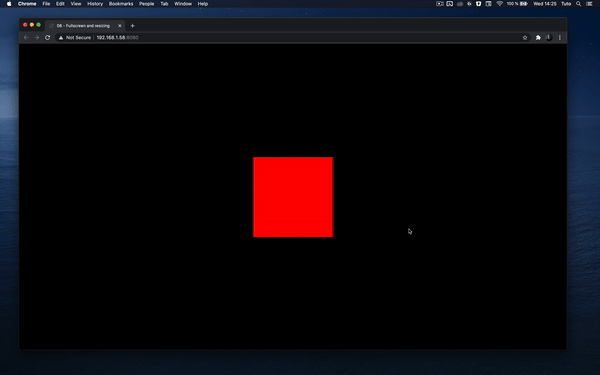
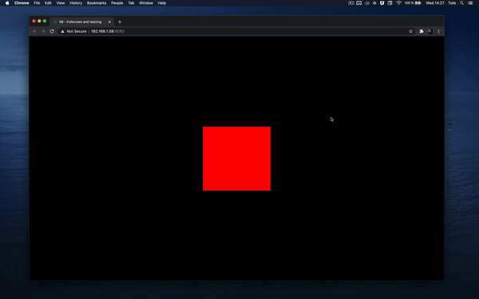

# Fullscreen and Resizing

## 시작에 앞서

현재 캔버스는 800x600의 고정 해상도를 가지고 있습니다. WebGL이 전체 화면을 차지할 필요는 없지만, 몰입감 있는 경험을 원한다면 화면을 꽉 채우는 것이 더 좋을 수 있습니다.

우선, 캔버스가 가능한 모든 공간을 차지하게 하고 싶습니다. 그다음, 사용자가 창 크기를 조절할 때도 여전히 적합하게 맞추는 것을 확실히 해야 합니다. 마지막으로, 사용자가 전체 화면에서 경험을 해볼 수 있는 방법을 제공해야 합니다.

## Viewport (뷰포트)에 맞게 조정

뷰포트에 완벽하게 맞도록 캔버스를 조정하려면, **`sizes`** 변수에서 고정된 숫자를 사용하는 대신 **`window.innerWidth`**와 **`window.innerHeight`**를 사용하세요:

```javascript
// ...

// 크기
const sizes = {
    width: window.innerWidth,
    height: window.innerHeight
}

// ...

```

<figure><figcaption></figcaption></figure>

이제 캔버스가 뷰포트의 너비와 높이를 가지고 있습니다. 불행히도, 흰색 여백과 스크롤 바가 있습니다(스크롤 바가 보이지 않으면 스크롤해 보세요).

문제는 브라우저마다 기본 스타일링이 있어, 제목이 더 크고, 링크에 밑줄이 있으며, 문단 사이에 공간이 있고, 페이지에 패딩이 있다는 것입니다. 이 문제를 해결하는 방법은 여러 가지가 있으며, 나머지 웹사이트에 따라 달라질 수 있습니다. 다른 콘텐츠가 있으면, 이 작업을 수행하면서 그 어떤 것도 깨지지 않도록 해보세요.

우리는 CSS를 사용하여 캔버스의 위치를 고정하는 것으로 간단히 문제를 해결할 것입니다.

우리의 HTML은 이미 **`src/style.css`** 파일을 로딩하고 있습니다:

```html
<link rel="stylesheet" href="./style.css">
```

평소처럼 표준 CSS를 작성할 수 있으며, 페이지는 자동으로 새로고침될 것입니다.

먼저 모든 요소에서 여백이나 패딩을 제거하는 것이 좋습니다. 이를 위해 와일드카드 **`*`**를 사용할 수 있습니다:

<pre class="language-css"><code class="lang-css"><strong>*
</strong>{
    margin: 0;
    padding: 0;
}
</code></pre>

\
그 다음, **`webgl`** 클래스를 사용하여 캔버스를 왼쪽 상단에 고정할 수 있습니다:

```css
.webgl {
    position: fixed;
    top: 0;
    left: 0;
}
```

Three.js가 **`renderer.setSize(...)`** 메소드를 호출할 때 이미 캔버스의 너비와 높이를 관리하고 있기 때문에, 캔버스에 너비나 높이를 지정할 필요가 없습니다.

이는 캔버스에 있는 작은 문제를 수정할 좋은 기회입니다. 드래그 앤 드롭할 때 캔버스에 파란색 윤곽선이 생기는 것을 눈치챘을 수 있습니다. 이는 주로 크롬의 최신 버전에서 발생합니다. 이를 해결하기 위해, **`.webgl`**에 **`outline: none;`**을 추가하면 됩니다:

```css
.webgl {
    position: fixed;
    top: 0;
    left: 0;
    outline: none;
}
```

터치 스크린을 포함해 어떠한 스크롤링도 제거하고 싶다면, **`html`**과 **`body`**에 **`overflow: hidden;`**을 추가할 수 있습니다:

```css
html,
body {
    overflow: hidden;
}
```

## 크기 재조절

캔버스 크기를 조절하려면, 우선 창이 조절될 때를 알아야 합니다. 이를 위해 `window`에서 `resize` 이벤트를 듣습니다.

**`sizes`** 변수 바로 다음에 **`resize`** 리스너를 추가하세요:

```javascript
window.addEventListener('resize', () =>
{
    console.log('window has been resized')
})
```

이제 창이 조절될 때 함수를 트리거하므로, 코드에서 몇 가지를 업데이트해야 합니다.

먼저, **`sizes`** 변수를 업데이트해야 합니다:

```javascript
window.addEventListener('resize', () =>
{
    // 크기 업데이트
    sizes.width = window.innerWidth
    sizes.height = window.innerHeight
})
```

둘째로, 카메라의 **`aspect`** 속성을 변경하여 카메라의 종횡비를 업데이트해야 합니다:

```javascript
window.addEventListener('resize', () =>
{
    // ...

    // 카메라 업데이트
    camera.aspect = sizes.width / sizes.height
})
```

카메라 속성인 **`aspect`**를 변경할 때는 **`camera.updateProjectionMatrix()`**를 사용하여 투영 행렬을 업데이트해야 합니다. 행렬에 대해서는 나중에 논의할 것입니다:

```javascript
window.addEventListener('resize', () =>
{
    // ...

    camera.updateProjectionMatrix()
})
```

마지막으로, 렌더러를 업데이트해야 합니다. 렌더러를 업데이트하면 캔버스의 너비와 높이가 자동으로 업데이트됩니다:

```javascript
window.addEventListener('resize', () =>
{
    // ...

    // 렌더러 업데이트
    renderer.setSize(sizes.width, sizes.height)
})
```

다음과 같이 완성:

```javascript
window.addEventListener('resize', () =>
{
    // Update sizes
    sizes.width = window.innerWidth
    sizes.height = window.innerHeight

    // Update camera
    camera.aspect = sizes.width / sizes.height
    camera.updateProjectionMatrix()

    // Update renderer
    renderer.setSize(sizes.width, sizes.height)
})
```

<figure><figcaption></figcaption></figure>

창 크기를 원하는 대로 조절할 수 있으며, 캔버스는 스크롤 바나 오버플로우 없이 뷰포트를 커버해야 합니다.

## 픽셀 비율 처리

일부 사용자는 렌더링이 다소 흐릿하게 보이고, 가장자리에 계단 모양의 아티팩트(앨리어싱이라고 함)가 나타날 수 있습니다. 하지만 모든 사람에게 그런 것은 아닙니다. 이러한 현상이 발생하는 경우, 화면의 픽셀 비율이 1보다 큰 스크린에서 테스트하고 있기 때문입니다.

픽셀 비율은 소프트웨어 부분에서 하나의 픽셀 단위에 대해 화면상에 몇 개의 물리적 픽셀이 있는지에 해당합니다.

### 역사적 배경

몇 년 전까지 모든 스크린은 픽셀 비율이 1이었고 모든 것이 잘 작동했습니다. 하지만 화면을 자세히 보면 그 픽셀들을 볼 수 있었고, 이미지의 정밀도와 글꼴의 세밀함에 있어 한계가 있었습니다.

이 문제에 가장 많이 대응한 회사는 애플이었습니다. 애플은 기회를 보고 픽셀 비율이 2인 레티나 스크린을 제작하기 시작했습니다. 이제 많은 제조사들이 더 높은 픽셀 비율의 스크린을 만들고 있습니다.

이미지 품질에는 좋은 변화이지만, 픽셀 비율이 2라는 것은 렌더링해야 할 픽셀 수가 4배 증가한다는 것을 의미합니다. 픽셀 비율이 3이라면, 9배 더 많은 픽셀을 렌더링해야 합니다.

그리고 맞춰보세요? 가장 높은 픽셀 비율은 보통 가장 약한 기기인 모바일 기기에 있습니다.

그러면 프레임 레이트가 문제가 됩니다.

### 픽셀 비율 처리

화면의 픽셀 비율을 얻으려면 **`window.devicePixelRatio`**를 사용할 수 있고, 렌더러의 픽셀 비율을 업데이트하려면 **`renderer.setPixelRatio(...)`**을 호출하기만 하면 됩니다.

장치 픽셀 비율을 그대로 해당 메소드에 전달하고 싶을 수 있지만, 고 픽셀 비율 기기에서 성능 문제가 발생할 것입니다.

픽셀 비율이 2보다 높은 것은 대부분 마케팅입니다. 2와 3 사이의 차이는 거의 눈에 띄지 않지만 성능 문제를 일으키고 배터리를 더 빨리 소모합니다. 픽셀 비율을 2로 제한할 수 있습니다. 이를 위해 **`Math.min()`**을 사용할 수 있습니다:

```javascript
renderer.setPixelRatio(Math.min(window.devicePixelRatio, 2))
```

<figure><figcaption></figcaption></figure>

픽셀 비율이 변경될 때 알림을 받는 기술들이 있지만, 이는 다른 픽셀 비율을 가진 여러 화면을 사용하는 사용자들에게만 해당되며, 그들은 대개 화면을 바꿀 때 창 크기를 조절합니다. 그래서 우리는 이 메소드를 **`resize`** 콜백에도 단순히 추가할 것입니다:

```javascript
window.addEventListener('resize', () =>
{
    // 크기 업데이트
    sizes.width = window.innerWidth
    sizes.height = window.innerHeight

    // 카메라 업데이트
    camera.aspect = sizes.width / sizes.height
    camera.updateProjectionMatrix()

    // 렌더러 업데이트
    renderer.setSize(sizes.width, sizes.height)
    renderer.setPixelRatio(Math.min(window.devicePixelRatio, 2))
})
```

이로써, 창 크기가 조절될 때뿐만 아니라 픽셀 비율이 변경될 가능성이 있는 상황에서도 렌더러 설정을 적절히 업데이트하여 최적의 성능과 이미지 품질을 유지할 수 있습니다. **`Math.min(window.devicePixelRatio, 2)`**를 사용함으로써 픽셀 비율을 최대 2로 제한함으로써 성능과 배터리 수명 사이에 균형을 맞추는 동시에, 사용자에게 충분히 좋은 이미지 품질을 제공할 수 있습니다.

## 전체화면 처리

캔버스가 가능한 모든 공간을 차지하고 올바른 픽셀 비율을 가지게 된 지금, 전체 화면 지원을 추가할 시간입니다.

먼저, 전체 화면 모드를 트리거할 작업을 결정해야 합니다. HTML 버튼을 사용할 수도 있지만, 대신 더블 클릭을 사용할 것입니다.

더블 클릭이 발생하면, 전체 화면을 토글합니다.  즉, 창이 전체 화면이 아닌 경우 더블 클릭하면 전체 화면 모드가 활성화되고, 창이 이미 전체 화면인 경우 더블 클릭하면 전체 화면 모드가 종료됩니다.

먼저, 더블 클릭 이벤트를 듣고, 이를 **`dblclick`** 이벤트로 할 수 있습니다:

```javascript
window.addEventListener('dblclick', () =>
{
    console.log('double click')
})
```

이 이벤트는 대부분의 현대 브라우저에서 작동하지만, Chrome Android에서는 작동하지 않습니다: [https://developer.mozilla.org/docs/Web/API/Element/dblclick\_event](https://developer.mozilla.org/docs/Web/API/Element/dblclick\_event)

\
이 이벤트는 대부분의 현대 브라우저에서 작동하지만, Chrome Android에서는 작동하지 않습니다: [https://developer.mozilla.org/docs/Web/API/Element/dblclick\_event](https://developer.mozilla.org/docs/Web/API/Element/dblclick\_event)

이벤트를 설정했으니, 이제 필요한 것은 3가지입니다:

1. 이미 전체 화면인지 아닌지를 알 수 있는 방법
2. 전체 화면 모드로 전환하는 메소드
3. 전체 화면 모드를 떠나는 메소드

전체 화면인지 여부를 알기 위해 **`document.fullscreenElement`**를 사용할 수 있습니다:

```javascript
window.addEventListener('dblclick', () =>
{
    if(!document.fullscreenElement)
    {
        console.log('go fullscreen')
    }
    else
    {
        console.log('leave fullscreen')
    }
})
```

전체 화면 요청 메소드는 요소와 연결되어 있습니다. 이는 전체 화면으로 만들 대상을 선택할 수 있기 때문입니다. 전체 페이지, DOM 요소 중 하나 또는 **`<canvas>`**가 될 수 있습니다.

우리는 **`<canvas>`**를 사용하고 그 위에서 **`requestFullscreen()`** 메소드를 호출할 것입니다:

```javascript
window.addEventListener('dblclick', () =>
{
    if(!document.fullscreenElement)
    {
        canvas.requestFullscreen()
    }
    else
    {
        console.log('leave fullscreen')
    }
})
```

전체 화면 모드를 떠나는 메소드는 문서(document)에서 직접 사용할 수 있습니다:

```javascript
window.addEventListener('dblclick', () =>
{
    if(!document.fullscreenElement)
    {
        canvas.requestFullscreen()
    }
    else
    {
        document.exitFullscreen()
    }
})
```

<figure><figcaption></figcaption></figure>

더블 클릭하여 전체 화면 모드를 토글할 수 있습니다. 하지만 불행히도 이 기능은 Safari에서 작동하지 않습니다.

Safari 브라우저는 전체 화면과 같은 간단한 기능을 공식적으로 지원하는 데 시간이 걸리며, **`document.fullscreenElement`**, **`canvas.requestFullscreen`**, 그리고 **`document.exitFullscreen`**에 대해 접두어가 붙은 버전을 사용해야 Safari에서도 작동합니다:

```javascript
window.addEventListener('dblclick', () =>
{
    const fullscreenElement = document.fullscreenElement || document.webkitFullscreenElement

    if(!fullscreenElement)
    {
        if(canvas.requestFullscreen)
        {
            canvas.requestFullscreen()
        }
        else if(canvas.webkitRequestFullscreen)
        {
            canvas.webkitRequestFullscreen()
        }
    }
    else
    {
        if(document.exitFullscreen)
        {
            document.exitFullscreen()
        }
        else if(document.webkitExitFullscreen)
        {
            document.webkitExitFullscreen()
        }
    }
})
```

모든 모던 브라우저에서는 잘 작동해야 합니다.
