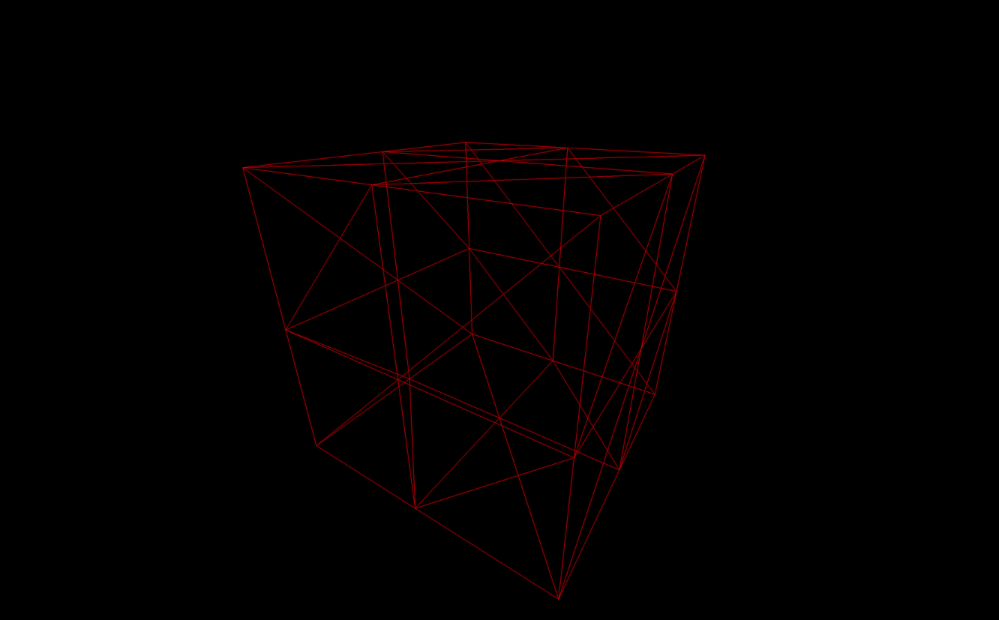

# Geometries

## 시작에 앞서

지금까지 우리는 큐브를 생성하기 위해 BoxGeometry 클래스만 사용했습니다. 이번 수업에서는 다양한 다른 기하학들을 발견할 것이지만, 먼저 기하학이 실제로 무엇인지 이해할 필요가 있습니다.

## 기하학이란 무엇인가?

Three.js에서 기하학은 3D 공간의 점 좌표인 꼭짓점(vertice)과 이 꼭짓점들을 연결하여 표면을 만드는 삼각형인 면(faces)으로 구성됩니다.

우리는 기하학을 사용하여 메시를 생성하지만, 기하학을 이용해 입자들을 형성하는 데에도 사용할 수 있습니다. 각 꼭짓점은 입자에 해당하지만, 이것은 미래의 수업을 위한 것입니다.

우리는 꼭짓점에 위치 데이터 이상을 저장할 수 있습니다. 좋은 예로 UV 좌표나 노멀(normals)에 대해 이야기할 수 있습니다. 보게 될 것처럼, 나중에 이러한 것들에 대해 더 배울 것입니다.

Three.js에는 많은 내장 기하학이 있습니다. 각각을 정확히 어떻게 인스턴스화하는지 알 필요는 없지만, 그것들이 존재한다는 것을 아는 것이 좋습니다.

우리가 볼 모든 내장 기하학은 BufferGeometry 클래스에서 상속됩니다. 이 클래스에는 **`translate(...)`**, **`rotateX(...)`**, **`normalize()`**, 등과 같은 많은 내장 메소드가 있지만, 이 수업에서는 그것들을 사용하지 않을 것입니다.

대부분의 기하학 문서 페이지에는 예제가 있습니다.

* **BoxGeometry**: 상자를 생성합니다.
* **PlaneGeometry**: 사각형 평면을 생성합니다.
* **CircleGeometry**: 원판 또는 원판의 일부(파이 차트처럼)를 생성합니다.
* **ConeGeometry**: 원뿔 또는 원뿔의 일부를 생성합니다. 원뿔의 밑면을 열거나 닫을 수 있습니다.
* **CylinderGeometry**: 원통을 생성합니다. 원통의 끝을 열거나 닫을 수 있으며, 각 끝의 반지름을 변경할 수 있습니다.
* **RingGeometry**: 평면 링 또는 평면 원의 일부를 생성합니다.
* **TorusGeometry**: 두께가 있는 링(도넛처럼) 또는 링의 일부를 생성합니다.
* **TorusKnotGeometry**: 어떤 종류의 매듭 기하학을 생성합니다.
* **DodecahedronGeometry**: 12면체 구를 생성합니다. 더 둥근 구를 위해 디테일을 추가할 수 있습니다.
* **OctahedronGeometry**: 8면체 구를 생성합니다. 더 둥근 구를 위해 디테일을 추가할 수 있습니다.
* **TetrahedronGeometry**: 4면체 구를 생성합니다(디테일을 늘리지 않으면 구가 별로 안됩니다). 더 둥근 구를 위해 디테일을 추가할 수 있습니다.
* **IcosahedronGeometry**: 대략적으로 같은 크기의 삼각형으로 구성된 구를 생성합니다.
* **SphereGeometry**: 면이 쿼드처럼 보이는 가장 인기 있는 유형의 구를 생성합니다(쿼드는 두 개의 삼각형의 조합입니다).
* **ShapeGeometry**: 경로를 기반으로 한 모양을 생성합니다.
* **TubeGeometry**: 경로를 따라 튜브를 생성합니다.
* **ExtrudeGeometry**: 경로를 기반으로 한 압출을 생성합니다. 베벨을 추가하고 제어할 수 있습니다.
* **LatheGeometry**: 꽃병 또는 꽃병의 일부(혁명과 더 비슷하게)를 생성합니다.
* **TextGeometry**: 3D 텍스트를 생성합니다. typeface json 형식의 글꼴을 제공해야 합니다.

Three.js에서 지원하지 않는 특정 기하학이 필요한 경우, 자바스크립트에서 직접 기하학을 생성하거나, 3D 소프트웨어에서 만들어 프로젝트에 가져올 수 있습니다. 이에 대해서는 나중에 더 배울 것입니다.

## 박스 예제

우리는 이미 큐브를 만들었지만, 파라미터에 대해 많이 언급하지 않았습니다. 대부분의 기하학들은 파라미터를 가지고 있으며, 사용하기 전에 항상 문서를 확인해야 합니다.

BoxGeometry는 6개의 파라미터를 가집니다:

* **width**: x축의 크기
* **height**: y축의 크기
* **depth**: z축의 크기
* **widthSegments**: x축에서의 세분화 정도
* **heightSegments**: y축에서의 세분화 정도
* **depthSegments**: z축에서의 세분화 정도

세분화는 면을 구성해야 할 삼각형의 양에 해당합니다. 기본값은 1이며, 면당 2개의 삼각형이 있음을 의미합니다. 세분화를 2로 설정하면, 면당 8개의 삼각형으로 구성됩니다:

```javascript
const geometry = new THREE.BoxGeometry(1, 1, 1, 2, 2, 2)
```

\
우리는 이미 큐브를 만들었지만, 파라미터에 대해 많이 언급하지 않았습니다. 대부분의 기하학들은 파라미터를 가지고 있으며, 사용하기 전에 항상 문서를 확인해야 합니다.

BoxGeometry는 6개의 파라미터를 가집니다:

* **width**: x축의 크기
* **height**: y축의 크기
* **depth**: z축의 크기
* **widthSegments**: x축에서의 세분화 정도
* **heightSegments**: y축에서의 세분화 정도
* **depthSegments**: z축에서의 세분화 정도

세분화는 면을 구성해야 할 삼각형의 양에 해당합니다. 기본값은 1이며, 면당 2개의 삼각형이 있음을 의미합니다. 세분화를 2로 설정하면, 면당 8개의 삼각형으로 구성됩니다:

```javascript
javascriptCopy codeconst geometry = new THREE.BoxGeometry(1, 1, 1, 2, 2, 2)
```

문제는 이 삼각형들을 볼 수 없다는 것입니다.

좋은 해결책은 우리의 재질에 **`wireframe: true`**를 추가하는 것입니다. 와이어프레임은 각 삼각형을 구분하는 선을 보여줄 것입니다:

```javascript
const material = new THREE.MeshBasicMaterial({ color: 0xff0000, wireframe: true })
```

<figure><figcaption></figcaption></figure>

각 면에 8개의 삼각형이 있다는 것을 볼 수 있습니다.

평평한 면의 큐브에는 그다지 관련이 없을 수 있지만, **`SphereGeometry`**를 사용할 때는 더 흥미롭습니다:

```javascript
const geometry = new THREE.SphereGeometry(1, 32, 32)
```

<figure><figcaption></figcaption></figure>

세분화를 더 많이 추가할수록 면을 구분하기 어려워집니다. 하지만 너무 많은 꼭짓점과 면은 성능에 영향을 미칠 수 있다는 점을 기억해야 합니다.

## 커스텀 지오메트리 만들기

가끔은 자체 기하학을 생성해야 할 필요가 있습니다. 기하학이 매우 복잡하거나 정밀한 모양을 가지고 있다면, 3D 소프트웨어에서 생성하는 것이 더 좋습니다(이에 대해서는 향후 수업에서 다룰 예정입니다), 하지만 기하학이 너무 복잡하지 않다면, **`BufferGeometry`**를 사용하여 직접 만들 수 있습니다.

자신만의 버퍼 기하학을 생성하려면, 빈 **`BufferGeometry`**를 인스턴스화하는 것으로 시작합니다. 우리는 간단한 삼각형을 만들 것입니다:

```javascript
// 빈 BufferGeometry 생성
const geometry = new THREE.BufferGeometry()
```

**`BufferGeometry`**에 꼭짓점을 추가하려면 **`Float32Array`**로 시작해야 합니다.

**`Float32Array`**는 네이티브 자바스크립트 타입 배열입니다. 이 안에는 float만 저장할 수 있으며, 배열의 길이는 고정되어 있습니다.

**`Float32Array`**를 생성할 때 길이를 지정한 다음 나중에 채울 수 있습니다:

```javascript
const positionsArray = new Float32Array(9)

// 첫 번째 꼭짓점
positionsArray[0] = 0
positionsArray[1] = 0
positionsArray[2] = 0

// 두 번째 꼭짓점
positionsArray[3] = 0
positionsArray[4] = 1
positionsArray[5] = 0

// 세 번째 꼭짓점
positionsArray[6] = 1
positionsArray[7] = 0
positionsArray[8] = 0
```

또는 배열을 전달할 수 있습니다:

```javascript
const positionsArray = new Float32Array([
    0, 0, 0, // 첫 번째 꼭짓점
    0, 1, 0, // 두 번째 꼭짓점
    1, 0, 0  // 세 번째 꼭짓점
])
```

보시다시피, 꼭짓점의 좌표는 선형적으로 지정됩니다. 배열은 일차원 배열이며, 첫 번째 꼭짓점의 x, y, z를 지정한 다음 두 번째 꼭짓점의 x, y, z를 지정하는 식으로 계속됩니다.

이 배열을 **`BufferGeometry`**로 전송하기 전에, **`BufferAttribute`**로 변환해야 합니다.

첫 번째 매개변수는 타입화된 배열에 해당하고, 두 번째 매개변수는 하나의 꼭짓점 속성을 만드는 데 필요한 값의 수에 해당합니다. 앞서 보았듯이, 이 배열을 읽으려면 3개씩 묶어야 합니다. 왜냐하면 꼭짓점 위치는 3개의 값(x, y, z)으로 구성되기 때문입니다:

```javascript
const positionsAttribute = new THREE.BufferAttribute(positionsArray, 3)
```

그런 다음 **`setAttribute(...)`** 메소드를 사용하여 이 속성을 **`BufferGeometry`**에 추가할 수 있습니다. 첫 번째 매개변수는 이 속성의 이름이고, 두 번째 매개변수는 값입니다:

```java
geometry.setAttribute('position', positionsAttribute)
```

'position'이라는 이름을 선택한 이유는 Three.js 내부 셰이더가 꼭짓점의 위치를 결정하기 위해 해당 값을 찾기 때문입니다. 셰이더에 대해서는 셰이더 수업에서 더 자세히 다룰 것입니다.

면은 꼭짓점의 순서를 따라 자동으로 생성됩니다.

다음과 같이 완성:

```javascript
// 빈 BufferGeometry 생성
const geometry = new THREE.BufferGeometry()

// 꼭짓점 위치를 담고 있는 Float32Array 생성 (3개씩 묶어)
const positionsArray = new Float32Array([
    0, 0, 0, // 첫 번째 꼭짓점
    0, 1, 0, // 두 번째 꼭짓점
    1, 0, 0  // 세 번째 꼭짓점
])

// 속성을 생성하고 'position'이라고 이름 지음
const positionsAttribute = new THREE.BufferAttribute(positionsArray, 3)
geometry.setAttribute('position', positionsAttribute)
```

<figure><figcaption></figcaption></figure>

우리는 무작위 삼각형들을 많이 생성할 수도 있습니다:

```javascript
// 빈 BufferGeometry 생성
const geometry = new THREE.BufferGeometry()

// 50개의 삼각형 생성 (450개의 값)
const count = 50
const positionsArray = new Float32Array(count * 3 * 3)
for(let i = 0; i < count * 3 * 3; i++)
{
    positionsArray[i] = (Math.random() - 0.5) * 4
}

// 속성을 생성하고 'position'이라고 이름 지음
const positionsAttribute = new THREE.BufferAttribute(positionsArray, 3)
geometry.setAttribute('position', positionsAttribute)
```

<figure><figcaption></figcaption></figure>

유일한 어려움은 `count * 3 * 3` 부분일 수 있지만, 이것은 설명하기 꽤 간단합니다: 우리는 50개의 삼각형이 필요합니다. 각 삼각형은 3개의 꼭짓점으로 구성되며, 각 꼭짓점은 3개의 값(x, y, z)으로 구성됩니다.

## Index

**`BufferGeometry`**에서 흥미로운 점 중 하나는 **`index`** 속성을 사용하여 꼭짓점을 공유할 수 있다는 것입니다. 큐브를 고려해 보세요. 여러 면이 모서리에 있는 꼭짓점 같은 일부 꼭짓점을 사용할 수 있습니다. 그리고 자세히 살펴보면, 모든 꼭짓점은 여러 이웃 삼각형에 의해 사용될 수 있습니다. 이는 더 작은 속성 배열과 성능 개선으로 이어집니다. 하지만 이 부분은 이번 수업에서 다루지 않을 것입니다.
